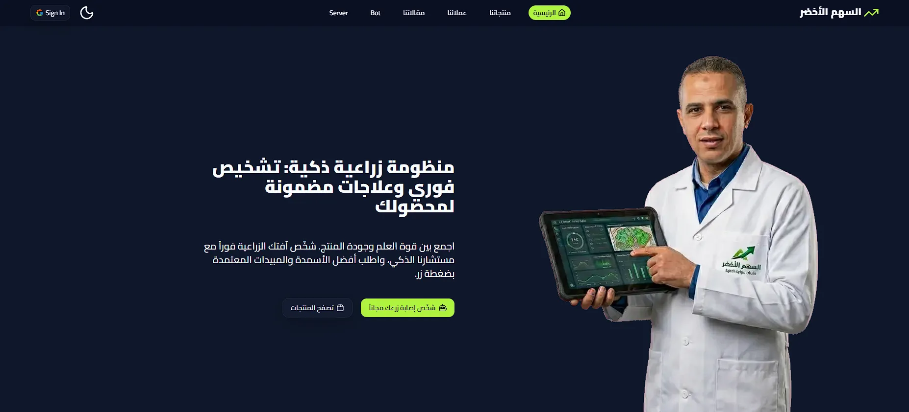

# Green Arrow

Green Arrow is a modern web application built with Next.js and TypeScript, designed to provide a complete agricultural platform with smart product management, a polished user experience, and AI-powered interaction.

## Overview

Green Arrow combines a modern frontend, secure authentication, structured data management, and intelligent automation to create a seamless experience for agricultural products and services.

## Key Features

- Modern and responsive user interface
- Product, factory, user, and component management
- Secure authentication and session handling
- AI-powered assistant integration for interactive support
- File upload and media management
- Scalable architecture for future growth

## Technologies Used

### Frontend

- Next.js 16: Chosen for high-performance React applications with App Router and strong support for modern web development.
- React 19: Provides a flexible foundation for building interactive and maintainable interfaces.
- TypeScript: Improves reliability by adding strong typing and reducing development errors.
- Tailwind CSS: Speeds up UI development while keeping the design flexible and modern.
- shadcn/ui + Radix UI: Offers high-quality, customizable components for a professional interface.

### State Management & UI

- Zustand: Lightweight and simple state management for clear and scalable app state.
- Motion: Used for smooth and polished animations that enhance the user experience.
- Lucide React + Hugeicons: Provide modern and visually appealing icons for the interface.

### Backend & Data Layer

- Prisma: Chosen for its strong database access layer, type safety, and clear migration workflow.
- PostgreSQL: A reliable and powerful relational database suitable for production applications.
- Zod: Used for data validation and enforcing input integrity before data is processed.

### Authentication

- Better Auth: Provides a modern and secure authentication system with session support.

### AI & Automation

- Mastra: Enables the development of AI agents, workflows, and intelligent tools.
- AI SDK: Simplifies integration with AI models and application logic.
- Ollama / Google AI: Offers flexibility in connecting with different AI providers.

### Media & Upload

- UploadThing: Provides a practical solution for file uploads with strong Next.js integration.

### Testing & Developer Experience

- Vitest: A fast and reliable testing framework for modern frontend projects.
- ESLint: Helps maintain code quality and consistency throughout development.

## Why These Technologies Were Chosen

These technologies were selected to balance:

- Performance
- Development speed
- Technical quality
- Scalability
- Maintainability

Next.js and React were chosen to create a modern and efficient application foundation, while Prisma and PostgreSQL provide a reliable backend structure. Mastra and the AI SDK make it possible to integrate intelligent features without unnecessary complexity.

## Project Structure

- src/app: Application pages and Next.js routes
- src/components: Reusable UI components
- src/forms: Input and edit forms
- src/lib: Shared configuration such as Prisma and authentication
- src/actions: Business logic and service operations
- src/bot: AI agents and workflows
- src/schemas: Data validation schemas
- prisma: Database schema and migrations
